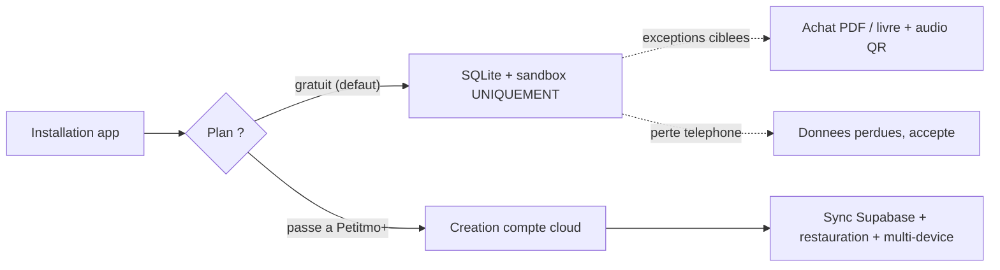

# AGENTS.md — Règle d'or Petitmo (à lire AVANT toute modification)

> Ce fichier doit être lu en début de session par tout agent IA travaillant sur ce dépôt.
> Avant tout correctif touchant **import / souvenirs / livres / paywall / auth / sync**,
> citer la règle d'or ci-dessous et vérifier que la solution la respecte.

---

## Paiements — règle absolue

Les abonnements Petitmo+ sont gérés **exclusivement via les stores natifs** :

- **iOS** : Apple In-App Purchase (StoreKit)
- **Android** *(à venir)* : Google Play Billing
- **Middleware** : RevenueCat gère les deux, valide les receipts et envoie les webhooks à une Edge Function Supabase

**Stripe n'a aucun rôle dans les abonnements in-app.** Toute mention de Stripe dans ce contexte est une erreur à corriger.

La seule exception possible à terme : un achat web (livre, PDF) hors store — mais ce n'est pas encore en place.

### Initialisation RevenueCat

RevenueCat s'initialise **dès le premier lancement de l'app**, pour toutes les utilisatrices y compris gratuites, en silence total. Il crée un ID anonyme lié à l'appareil sur ses propres serveurs — **aucune écriture Supabase**, aucune donnée personnelle collectée. C'est obligatoire et intentionnel : ne jamais supprimer cette initialisation au prétexte du mode local.

---

### Séquence de paiement — ordre non négociable

```
1. Paywall s'ouvre
2. Utilisatrice choisit mensuel / annuel
3. Apple IAP (StoreKit) gère le paiement
4. ── PAIEMENT CONFIRMÉ ── ← seul déclencheur de la suite
5. Écran "Crée ton compte" → Google / Apple / email + mot de passe
6. Compte Supabase créé
7. Purchases.logIn(supabaseUser.id) → lie l'achat RevenueCat au compte
8. Webhook RevenueCat → Edge Function → app_metadata { subscriptionTier: "paid" }
9. AsyncStorage mis à jour → userTier = 'paid'
10. Upload silencieux des souvenirs locaux vers Supabase
```

**Si le paiement échoue :** rien n'est créé côté Supabase, utilisatrice reste sur le paywall.
**Si elle abandonne :** idem, retour en mode gratuit sans trace.

Le compte Supabase ne se crée **jamais** avant l'étape 4. Tout compte créé avant paiement confirmé est une erreur.

---

### Migration des souvenirs locaux au passage payant (étape 10)

- Upload en arrière-plan, sans bloquer la navigation.
- Afficher pendant l'upload : **"Merci de t'être abonnée 🤍 Nous sécurisons tous tes souvenirs sur petitmo cloud. Merci de ne pas fermer l'app pendant quelques instants."**
- Ordre d'upload : textes → photos → audios → vidéos (du plus léger au plus lourd).
- Si coupure réseau : reprendre silencieusement à la reconnexion, sans re-solliciter l'utilisatrice.
- Volume garanti raisonnable en gratuit : max 50 souvenirs (20 en test), 5 vidéos de 30s max, 5 audios de 60s max.

---

### Où vit `subscriptionTier=paid` ?

**Réponse : option A — `app_metadata` sur `auth.users` dans Supabase.**

C'est la solution standard de l'intégration officielle RevenueCat + Supabase :
1. RevenueCat envoie un webhook à une Edge Function Supabase à chaque événement (achat, renouvellement, expiration, remboursement).
2. L'Edge Function met à jour `auth.users.app_metadata` avec `{ "subscriptionTier": "paid" }` (ou `"free"` à l'expiration).
3. `app_metadata` est accessible dans les RLS policies et côté serveur — jamais modifiable par le client.
4. L'app lit ce statut via l'API Supabase et le cache en local dans AsyncStorage (`petitmo:userTier`) comme cache UX uniquement.

---

## Règle d'or (non négociable)

Petitmo a **deux modes** et **deux modes seulement** :

### 1. MODE LOCAL — plan gratuit, sans compte

- **Ultra simple, zéro friction, instantané, sans inscription obligatoire.**
- Dès l'install, la maman peut **immédiatement** :
  - écrire un souvenir texte ;
  - ajouter une / plusieurs photos ;
  - enregistrer un audio ;
  - créer un livre **sans la vidéo** (pas de QR vidéo en gratuit) mais **avec audio**.
- **Tout** est stocké :
  - en **SQLite local** ;
  - dans le **sandbox / app storage** du téléphone.
- Conséquences explicites et acceptées :
  - **aucun cloud**, **aucun backup**, **aucune sync multi-appareil** ;
  - **si perte du téléphone, les données sont perdues** (assumé produit).

#### Exceptions Supabase autorisées en mode local

Ce sont les **seuls** moments où le mode gratuit écrit en base distante :

1. **Achat PDF / livre** (commande / paiement à l'acte).
2. **Stockage du souvenir audio** uniquement quand il faut un **QR code pérenne** dans le livre commandé.

Aucune autre écriture cloud n'est permise en gratuit. Pas de "petite sync gentille en arrière-plan", pas de backup auto, pas de "au cas où".

### 2. MODE CLOUD — Petitmo+ (abonnement payant)

- **Abonnement = compte** : le paywall vient d'abord, puis la création/lien du compte après paiement réussi — via **Google**, **Apple** ou **email + mot de passe** (dans cet ordre de présentation).
- À partir de là deviennent possibles :
  - sync cloud des souvenirs / enfants ;
  - restauration / changement d'iPhone ;
  - multi-device ;
  - QR pérennes (audio **et** vidéo) ;
  - exports serveur (PDF haute qualité).

---

## Conséquences UX directes (à respecter sans exception)

- Sur l'écran d'accueil, on peut afficher **"J'ai déjà un compte"** (login classique).
  Si l'email n'a **pas** de compte cloud Petitmo+ (même si l'email existe en base à cause d'une commande),
  afficher un message clair : **"Cette adresse e-mail n'a pas de compte cloud payant associé"**
  + CTA **"Créer un compte"** (upgrade Petitmo+).
- **Aucune création de compte email/mot de passe** déclenchée par un parcours gratuit.
- Le "device-user" Supabase auto-créé dans `app/_layout.tsx` est une **mécanique technique**
  pour les exceptions ci-dessus ; il n'est **jamais** présenté à l'utilisatrice comme un compte.
- Tout texte qui suggère "tes souvenirs sont sauvegardés" en gratuit est **interdit**.
  Le badge actuel "Confidentialité 100% préservée" est OK.
- En gratuit : la vidéo dans un livre est **bloquée** avec message clair vers le paywall
  (cf. `BookUpgradeRequiredError` dans `services/books.ts`).

### Paywall — hero selon le contexte (`app/paywall.tsx`)

- **Quota souvenirs gratuit atteint** (`context=LIMIT_REACHED` uniquement) : hero chiffré du type « Vous avez capturé vos N premiers souvenirs » + sous-texte du type « Continuez à préserver… » — pour que le message soit **factuel** et lié au plafond gratuit.
- **Toute autre entrée** (onboarding « S’abonner », vidéo dans un livre, export, audio/vidéo hors quota souvenirs, nudges J+30…, ou absence de `context`) : hero **neutre**, sans évoquer un nombre de souvenirs capturés : ligne 1 **« Préservez chaque moment »** (saut après *moment*), ligne 2 **« avec votre enfant, sans limite »** + pictogramme **cœur Lucide** plein **rosé charte** (`THEME.brandPrimary`). CTA principal paywall en **rosé charte**.
- Exception UI : flux **export PDF numérique à l’acte** (`EXPORT_DIGITAL_PDF`) conserve son propre titre / sous-titre (achat hors abonnement).
- Passer explicitement `params.context` depuis chaque écran ; défaut = **`GENERAL`** (plus **`LIMIT_REACHED`** si param absent).

---

## Architecture — pointeurs code à connaître

| Concept | Fichier |
|---|---|
| Mode `local` vs `cloud` (dérivé du tier) | [`lib/userMode.ts`](lib/userMode.ts) |
| Tier `free` vs `paid` (source de vérité) | [`lib/userTier.ts`](lib/userTier.ts) |
| Limites plan gratuit (souvenirs, audio, vidéo) | [`lib/limits.ts`](lib/limits.ts) |
| Capture 100% locale (gratuit) | [`services/localOnlyMemoryCapture.ts`](services/localOnlyMemoryCapture.ts) |
| Garde-fou livre gratuit + erreur upgrade | [`services/books.ts`](services/books.ts) |
| Création device-user Supabase (mécanique technique) | [`app/_layout.tsx`](app/_layout.tsx) |
| Écran d'accueil | [`app/onboarding.tsx`](app/onboarding.tsx) |
| Paywall (contexte hero, `GENERAL` / `LIMIT_REACHED`…) | [`app/paywall.tsx`](app/paywall.tsx) |
| Parité aperçu livre ↔ export PDF (checklist miroirs) | [`.cursor/rules/book-maquette-pdf-parity.mdc`](.cursor/rules/book-maquette-pdf-parity.mdc) |
| Référence canonique complète | [`docs/specs/architecture-locale-cloud.md`](docs/specs/architecture-locale-cloud.md) |

### Livre et PDF — date affichée (photo, vidéo, audio, légendes)

- Sous les **médias** et partout où le livre affiche une **date de souvenir**, la source est **`memories.created_at`** : date de **prise / de l’événement** (EXIF, fichier, enregistrement…).
- **`inserted_at`** sert uniquement à l’**ordre du fil** (date d’ajout dans l’app) — **ne jamais** l’utiliser pour ce libellé dans la maquette, le serveur PDF (`server/src/pdf/htmlBook.ts`), ni le payload **`guestMemories`** (`created_at` obligatoire côté client pour aligner PDF exporté et aperçu ; voir `mapGuestMemories` dans `server/src/routes/generatePdf.ts`).
- Helper unique côté app : [`utils/memoryBookDisplayDate.ts`](utils/memoryBookDisplayDate.ts) (`memoryBookDisplayDateIso`). Côté serveur : `server/src/pdf/memoryBookDisplayDate.ts`.

### Export livre PDF — **uniquement** le service distant (aucune génération sur l’appareil)

- La **génération** d’un PDF livre depuis l’app se fait **exclusivement** via [`services/bookPdfServer.ts`](services/bookPdfServer.ts) (Playwright / Chromium sur Railway ou équivalent). **`expo-print` et tout rendu HTML→PDF sur le téléphone sont interdits** — pas d’exception « dev », pas de repli si l’URL serveur est absente.
- Si `EXPO_PUBLIC_PDF_SERVER_URL` est absent ou injoignable : message utilisateur (`PDF_EXPORT_REQUIRES_SERVER_MESSAGE` ou `EXPORT_SERVER_FAILED_CONTACT_MESSAGE`) ; **pas** de PDF produit localement.
- [`services/bookPdf.ts`](services/bookPdf.ts) ne contient plus que **`shareBookPdf`** (partage d’un fichier déjà obtenu du serveur).

**Parité déploiement Supabase — service PDF Railway** : le Node `server/` utilise la **service role** sur les tables du flux export (ex. `public_media_tokens`). Dès qu’une PR ajoute ou utilise une **colonne ou table** côté serveur, il doit exister une migration sous [`supabase/migrations/`](supabase/migrations/) et elle doit être **appliquée en prod** avant ou avec le push Railway. Sinon les inserts échouent ; symptôme historique : **502** sur `generate-pdf` alors que `/health` répond 200 (ex. colonne manquante `expires_at` → migration `20260505120000_public_media_tokens_expires_at.sql`).

### Parité maquette livre ↔ export PDF

L’aperçu in-app (`MaquetteBookPages.tsx`) et le PDF serveur (`htmlBook.ts`) partagent le **même contenu de pages** ; digital et impression ne diffèrent que par le format `@page` et le fond perdu.

- Toute modification de **mise en page, typo, couleurs, recadrage ou texte affiché** dans l’aperçu livre doit être reportée **dans le même PR** sur `server/src/pdf/` (et helpers miroirs).
- Checklist complète, fichiers couplés et règles typo (Roboto Flex souvenirs vs Garamond éditorial) : [`.cursor/rules/book-maquette-pdf-parity.mdc`](.cursor/rules/book-maquette-pdf-parity.mdc).
- Après changement côté serveur : **redéployer** `server/` (Railway/VPS) — un reload Metro ne met pas à jour l’export PDF.

### Local-first universel (gratuit et Petitmo+)

- **Affichage** : SQLite + sandbox — jamais un `supabase.from(...).select` direct dans un composant UI.
- **Cloud** : sync / pull / upload **en arrière-plan** ; merge via `mergeServerMemoryRowWithExistingLocal`.
- **Bascule gratuit → payant** : données locales visibles tout de suite ; `upgradeToFullCloud` + `flushPendingCloudUploadsOnce` sans bloquer la navigation.
- **Repli cloud** : seulement si local confirmé absent (fichier mort, réinstall, nouveau téléphone en restauration).
- Référence : [`docs/specs/architecture-locale-cloud.md`](docs/specs/architecture-locale-cloud.md) §1.3, [`.cursor/rules/local-first-media.mdc`](.cursor/rules/local-first-media.mdc).

---

## Distinction critique : email de commande vs compte cloud Petitmo+

- Un **email peut exister en base** pour des raisons **commande/CRM** (gratuit) sans être un **compte cloud**.
- **Compte cloud Petitmo+** = email (ou Apple/Google) **associé à un abonnement payant** et donnant droit à la sync/restauration.
- La **source de vérité** de ce statut est **serveur** : `subscriptionTier=paid` dans **`auth.users.app_metadata`** (Supabase),
  alimenté par webhook **RevenueCat** → Edge Function Supabase (Apple IAP / StoreKit sur iOS, Google Play Billing sur Android à venir). Stripe n'intervient pas dans les abonnements in-app. L'AsyncStorage local n'est qu'un cache UX.
- En gratuit : l'email sert au **suivi de commande**, aux **QR audio** du livre commandé, et au **CRM** (marketing futur),
  mais **ne doit jamais** être traité comme un identifiant de restauration.

---

## Diagramme



---

## Comportement attendu de l'agent

1. **Toujours** lire ce fichier en début de session avant tout correctif sensible.
2. **Citer la règle d'or en une ligne** au début de tout plan ou patch touchant : import, souvenirs, livres, paywall, auth, sync, écran d'accueil, paramètres.
3. Si une demande utilisateur entre en conflit avec la règle d'or, **lever le drapeau immédiatement** plutôt que de l'exécuter en silence.
4. Pour toute exception Supabase en gratuit, vérifier qu'elle correspond bien à un des **deux cas autorisés** (achat PDF/livre, audio QR pérenne).
5. Export PDF livre : **uniquement** serveur — voir **« Export livre PDF — uniquement le service distant »** ci-dessus ; jamais `expo-print` / génération locale.
6. Changement livre / maquette : lire et appliquer [`.cursor/rules/book-maquette-pdf-parity.mdc`](.cursor/rules/book-maquette-pdf-parity.mdc) — maintenir la parité aperçu ↔ `htmlBook.ts` dans le même PR.
