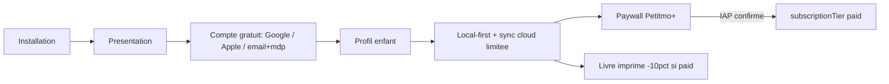

# AGENTS.md — Règle d'or Petitmo (à lire AVANT toute modification)

> Ce fichier doit être lu en début de session par tout agent IA travaillant sur ce dépôt.
> Avant tout correctif touchant **import / souvenirs / livres / paywall / auth / sync**,
> citer la règle d'or ci-dessous et vérifier que la solution la respecte.
>
> **Orientation produit V2 (2026-07-22)** : fin du « gratuit sans compte ». Compte gratuit
> obligatoire + sync cloud limitée. Remise impression Petitmo+ = **10 %** (`PRINT_V1_PAID_DISCOUNT_PERCENT`).
> Spec longue historique à réaligner : [`docs/specs/architecture-locale-cloud.md`](docs/specs/architecture-locale-cloud.md)
> (peut encore décrire l’ancien modèle local-only — **ce fichier prime**).

---

## Paiements — règle absolue

Les abonnements Petitmo+ sont gérés **exclusivement via les stores natifs** :

- **iOS** : Apple In-App Purchase (StoreKit)
- **Android** *(à venir)* : Google Play Billing
- **Middleware** : RevenueCat gère les deux, valide les receipts et envoie les webhooks à une Edge Function Supabase

**Stripe n'a aucun rôle dans les abonnements in-app.** Toute mention de Stripe dans ce contexte est une erreur à corriger.

La seule exception possible à terme : un achat web (livre, PDF) hors store — mais ce n'est pas encore en place.

### Initialisation RevenueCat

RevenueCat s'initialise **dès le premier lancement de l'app**, pour toutes les utilisatrices y compris gratuites, en silence total. Il crée un ID anonyme lié à l'appareil sur ses propres serveurs — **aucune écriture Supabase Auth**, aucune donnée personnelle collectée. Dès qu’un compte Supabase existe, appeler **`Purchases.logIn(supabaseUser.id)`**. Ne jamais supprimer cette initialisation.

---

### Séquence abonnement — ordre non négociable (compte déjà créé)

Le compte gratuit est créé **pendant l’onboarding** (voir règle d’or). L’abonnement ne crée **pas** le compte :

```
1. Utilisatrice déjà authentifiée (compte gratuit)
2. Paywall s'ouvre
3. Choix mensuel / annuel
4. Apple IAP (StoreKit) gère le paiement
5. ── PAIEMENT CONFIRMÉ ── ← seul déclencheur de la suite
6. Purchases.logIn(supabaseUser.id) si pas déjà lié
7. Webhook RevenueCat → Edge Function → app_metadata { subscriptionTier: "paid" }
8. AsyncStorage mis à jour → userTier = 'paid'
9. Quotas / features Petitmo+ débloqués (HD cloud, etc.) ; sync déjà active en gratuit
```

**Si le paiement échoue ou est abandonné :** l’utilisatrice reste sur le plan gratuit (compte + sync limitée), sans `subscriptionTier=paid`.

---

### Où vit `subscriptionTier=paid` ?

**Réponse : option A — `app_metadata` sur `auth.users` dans Supabase.**

1. RevenueCat envoie un webhook à une Edge Function Supabase à chaque événement (achat, renouvellement, expiration, remboursement).
2. L'Edge Function met à jour `auth.users.app_metadata` avec `{ "subscriptionTier": "paid" }` (ou `"free"` à l'expiration).
3. `app_metadata` est accessible dans les RLS policies et côté serveur — jamais modifiable par le client.
4. L'app lit ce statut via l'API Supabase et le cache en local dans AsyncStorage (`petitmo:userTier`) comme cache UX uniquement.

Un compte authentifié **sans** `subscriptionTier=paid` = **plan gratuit** (sync cloud limitée), **pas** « pas de compte ».

---

## Règle d'or V2 (non négociable)

Petitmo a **deux plans** sur une **même identité** (compte obligatoire) :

### 1. PLAN GRATUIT — compte + cloud limité (local-first)

- **Compte obligatoire** avant d’accumuler des souvenirs pour de vrai.
- **Onboarding (ordre)** :
  1. présentation rapide ;
  2. écran création / connexion de compte ;
  3. profil de l’enfant ;
  4. entrée dans l’app (fil).
- **Auth** (ordre de présentation) : **Google** → **Apple** → **email + mot de passe**, avec **mot de passe oublié** prévu dès le départ. Lien **« J’ai déjà un compte »** = login.
- **Local-first** : l’UI lit **SQLite + sandbox** en premier ; sync cloud **en arrière-plan** dès le gratuit.
- **Promesse** : *« tes souvenirs restent privés et sauvegardés »*.  
  **Pas** de partage familial / diffusion (Petitmo = relation intime parent–enfant, pas TinyBeans).  
  **Zéro pub**, même en gratuit.
- **Quotas fil gratuit** (cible produit — aligner `lib/limits.ts`) :
  - **50** souvenirs au total ;
  - **vidéo** : max **5** souvenirs, **20 s** chacun ;
  - **audio** : **60 s** par souvenir, **pas** de cap de nombre séparé (borné par les 50) ;
  - *(code actuel : encore `FREE_TIER_VOICE_LIMIT = 5` — à retirer pour aligner).*
- **Photos** : **thumb + print A5** en cloud dès le gratuit ; **original HD** reste local. Petitmo+ débloque le **HD cloud**.
- **Livre imprimé** : accessible à toutes (gratuites et payantes). Remise Petitmo+ = **−10 %** sur la partie livre (`lib/pricingV1.ts`). QR A/V : composition libre ; facturation au checkout (2 inclus + 0,70 €) — specs pricing / QR.
- Le **`user_id` anonyme (device-user)** n’est **plus** le socle produit. Cas limite technique éventuel seulement ; **cible bêta** : pas de commande livre sans compte authentifié.

### 2. PLAN PETITMO+ — abonnement payant

- Même compte ; `subscriptionTier=paid` côté serveur.
- Débloque notamment : quotas étendus / sans les plafonds gratuits, **HD photo cloud**, avantages print (**−10 %**), et le reste des features payantes définies au paywall.
- Local-first **conservé** : sync / pull / materialisation comme aujourd’hui pour le cloud.

---

## Conséquences UX directes

- **« J’ai déjà un compte »** : login Google / Apple / email+mdp (pas un placeholder « bientôt » une fois le chantier auth livré).
- Textes du type **« tes souvenirs sont sauvegardés »** : **autorisés** dès le gratuit (c’est la promesse).
- **Interdit** : promettre du partage familial / multi-membres comme bénéfice cœur (hors scope V1).
- **Suppression de compte in-app** : **P0** avant TestFlight public / App Store (exigence Apple) dès qu’on crée des comptes.
- Paywall — hero selon le contexte (`app/paywall.tsx`) :
  - **Quota souvenirs gratuit atteint** (`context=LIMIT_REACHED` uniquement) : hero chiffré du type « Vous avez capturé vos N premiers souvenirs » + sous-texte « Continuez à préserver… ».
  - **Toute autre entrée** : hero **neutre** — ligne 1 « Préservez chaque moment », ligne 2 « avec votre enfant, sans limite » + cœur Lucide rosé (`THEME.brandPrimary`). CTA principal **rosé charte**.
  - Exception : flux **export PDF numérique à l’acte** (`EXPORT_DIGITAL_PDF`) — titre / sous-titre propres.
  - Passer explicitement `params.context` ; défaut = **`GENERAL`**.

---

## Architecture — pointeurs code à connaître

| Concept | Fichier |
|---|---|
| Mode / tier (à réaligner free=compte+sync) | [`lib/userMode.ts`](lib/userMode.ts) · [`lib/userTier.ts`](lib/userTier.ts) |
| i18n FR/EN — migration EN **gelée** pendant bêta FR | [`lib/i18n.ts`](lib/i18n.ts) · [`docs/specs/i18n-en-roadmap.md`](docs/specs/i18n-en-roadmap.md) |
| Go / no-go bêta FR | [`docs/qa/BETA_FR_GO_NOGO.md`](docs/qa/BETA_FR_GO_NOGO.md) |
| Limites plan gratuit | [`lib/limits.ts`](lib/limits.ts) |
| Capture (à faire évoluer : local + enqueue sync) | [`services/localOnlyMemoryCapture.ts`](services/localOnlyMemoryCapture.ts) |
| Garde-fou livre (durées A/V) | [`services/books.ts`](services/books.ts) `validateFreeTierBookMemoryLimits` |
| Tarif impression V1 (−10 % paid) | [`lib/pricingV1.ts`](lib/pricingV1.ts) · [`docs/specs/pricing-v1-migration.md`](docs/specs/pricing-v1-migration.md) |
| QR audio/vidéo livre | [`docs/specs/free-tier-book-qr-av.md`](docs/specs/free-tier-book-qr-av.md) |
| Materialisation cloud → sandbox | [`services/memoryCloudMaterialize.ts`](services/memoryCloudMaterialize.ts) |
| Device-user (legacy / cas limite — ne plus étendre) | [`lib/ensureSupabaseSession.ts`](lib/ensureSupabaseSession.ts) · [`app/_layout.tsx`](app/_layout.tsx) |
| Onboarding | [`app/onboarding.tsx`](app/onboarding.tsx) |
| Paywall | [`app/paywall.tsx`](app/paywall.tsx) |
| Parité aperçu livre ↔ export PDF | [`.cursor/rules/book-maquette-pdf-parity.mdc`](.cursor/rules/book-maquette-pdf-parity.mdc) |
| Spec architecture (à mettre à jour vers V2) | [`docs/specs/architecture-locale-cloud.md`](docs/specs/architecture-locale-cloud.md) |

### Livre et PDF — date affichée (photo, vidéo, audio, légendes)

- Sous les **médias** et partout où le livre affiche une **date de souvenir**, la source est **`memories.created_at`** : date de **prise / de l’événement** (EXIF, fichier, enregistrement…).
- **`inserted_at`** = date d’ajout dans l’app (audit / pastille « import différé ») — **pas** l’ordre du fil ni le libellé date. L’**ordre du fil** et la date affichée dans le fil / viewer = **`created_at`**.
- Helpers : [`utils/memoryBookDisplayDate.ts`](utils/memoryBookDisplayDate.ts) · `server/src/pdf/memoryBookDisplayDate.ts`.

### Export livre PDF — **uniquement** le service distant

- Génération **exclusivement** via [`services/bookPdfServer.ts`](services/bookPdfServer.ts). **`expo-print` / PDF local interdits**.
- URL absente ou erreur → messages dédiés ; pas de repli local.
- [`services/bookPdf.ts`](services/bookPdf.ts) = **`shareBookPdf`** seulement.

**Parité déploiement Supabase ↔ Railway** : toute colonne/table utilisée par `server/` doit exister en prod (`supabase/migrations/`) avant ou avec le push Railway.

**QR médias livre** : token `ready` figé ; specs [`docs/specs/qr-media-permanence.md`](docs/specs/qr-media-permanence.md), [`docs/specs/free-tier-book-qr-av.md`](docs/specs/free-tier-book-qr-av.md).

### Parité maquette livre ↔ export PDF

Aperçu (`MaquetteBookPages.tsx`) et PDF (`htmlBook.ts`) = même contenu de pages. Toute modif layout/typo/couleurs/recadrage/texte → **même PR** sur `server/src/pdf/`. Voir [`.cursor/rules/book-maquette-pdf-parity.mdc`](.cursor/rules/book-maquette-pdf-parity.mdc).

### Local-first universel (gratuit et Petitmo+)

- **Affichage** : SQLite + sandbox — jamais un `supabase.from(...).select` direct dans un composant UI (y compris aperçu livre).
- **Cycle** : hydratation cloud → merge SQLite → **materialisation sandbox** → affichage local ; repli URL signée **transitoire** seulement.
- **Cloud** : sync / pull / upload **en arrière-plan** dès le **gratuit** (dans les quotas) ; merge via `mergeServerMemoryRowWithExistingLocal`.
- **Aperçu livre ≠ export PDF** : maquette local-first ; export via payload serveur.

---

## Compte gratuit vs Petitmo+

| | Compte gratuit | Petitmo+ (`subscriptionTier=paid`) |
|---|---|---|
| Identité Auth | Oui | Oui (même compte) |
| Sync / restore / multi-device | Oui (quotas) | Oui (étendus) |
| Photos cloud | Thumb + print A5 | + original HD |
| Remise livre imprimé | 0 % | **−10 %** |
| Pub | Non | Non |

Ne plus raisonner en « email commande ≠ compte » comme modèle principal : **le compte est l’identité**. Un email CRM sans Auth reste possible pour d’anciens flux, mais la cible produit est **compte d’abord**.

---

## Diagramme



---

## Chantiers produit (pas encore tous livrés dans le code)

1. Auth onboarding + login + mot de passe oublié  
2. Sync cloud dès le gratuit (limites ci-dessus)  
3. RevenueCat + webhook `subscriptionTier`  
4. Suppression de compte in-app (Apple)  
5. Dimensionnement coût Storage gratuit à l’échelle  
6. Réalignement `lib/limits.ts` (retirer le cap 5 audios ; durée déjà 60 s)  
7. Mise à jour `docs/specs/architecture-locale-cloud.md` + `supabase-write-policy.mdc`

---

## Comportement attendu de l'agent

1. **Toujours** lire ce fichier en début de session avant tout correctif sensible.
2. **Citer la règle d'or en une ligne** au début de tout plan ou patch touchant : import, souvenirs, livres, paywall, auth, sync, écran d'accueil, paramètres.  
   Exemple : *« Règle d’or V2 : compte gratuit + sync cloud limitée ; Petitmo+ = quotas/HD/−10 % print. »*
3. Si une demande entre en conflit avec la règle d'or, **lever le drapeau immédiatement**.
4. Ne **pas** réintroduire « gratuit sans compte » / « perte téléphone = perte données assumée » / interdiction de dire « sauvegardés » en gratuit.
5. Export PDF livre : **uniquement** serveur.
6. Changement livre / maquette : [`.cursor/rules/book-maquette-pdf-parity.mdc`](.cursor/rules/book-maquette-pdf-parity.mdc).
7. Remise print Petitmo+ = **10 %** — ne pas inventer 15 %.
