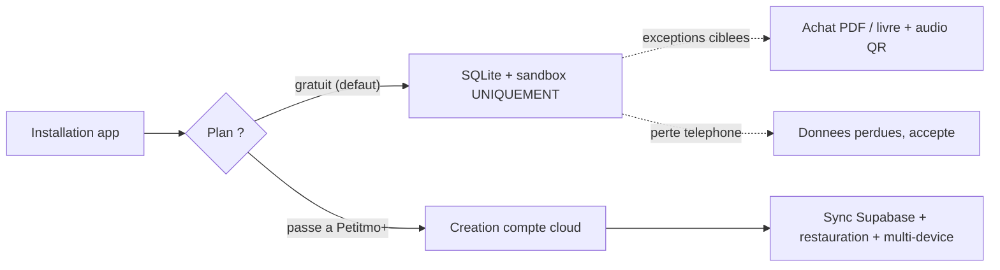

# AGENTS.md — Règle d'or Petitmo (à lire AVANT toute modification)

> Ce fichier doit être lu en début de session par tout agent IA travaillant sur ce dépôt.
> Avant tout correctif touchant **import / souvenirs / livres / paywall / auth / sync**,
> citer la règle d'or ci-dessous et vérifier que la solution la respecte.

---

## Règle d'or (non négociable)

Petitmo a **deux modes** et **deux modes seulement** :

### 1. MODE LOCAL — plan gratuit, sans compte

- **Ultra simple, zéro friction, instantané, sans inscription obligatoire.**
- Dès l'install, la maman peut **immédiatement** :
  - écrire un souvenir texte ;
  - ajouter une / plusieurs photos ;
  - enregistrer un audio ;
  - créer un livre **sans la vidéo** (pas de QR vidéo en gratuit) mais **avec audio**.
- **Tout** est stocké :
  - en **SQLite local** ;
  - dans le **sandbox / app storage** du téléphone.
- Conséquences explicites et acceptées :
  - **aucun cloud**, **aucun backup**, **aucune sync multi-appareil** ;
  - **si perte du téléphone, les données sont perdues** (assumé produit).

#### Exceptions Supabase autorisées en mode local

Ce sont les **seuls** moments où le mode gratuit écrit en base distante :

1. **Achat PDF / livre** (commande / paiement à l'acte).
2. **Stockage du souvenir audio** uniquement quand il faut un **QR code pérenne** dans le livre commandé.

Aucune autre écriture cloud n'est permise en gratuit. Pas de "petite sync gentille en arrière-plan", pas de backup auto, pas de "au cas où".

### 2. MODE CLOUD — Petitmo+ (abonnement payant)

- **Abonnement = compte** : le paywall vient d'abord, puis la création/lien du compte après paiement réussi — via **Google**, **Apple** ou **email + mot de passe** (dans cet ordre de présentation).
- À partir de là deviennent possibles :
  - sync cloud des souvenirs / enfants ;
  - restauration / changement d'iPhone ;
  - multi-device ;
  - QR pérennes (audio **et** vidéo) ;
  - exports serveur (PDF haute qualité).

---

## Conséquences UX directes (à respecter sans exception)

- Sur l'écran d'accueil, on peut afficher **"J'ai déjà un compte"** (login classique).
  Si l'email n'a **pas** de compte cloud Petitmo+ (même si l'email existe en base à cause d'une commande),
  afficher un message clair : **"Cette adresse e-mail n'a pas de compte cloud payant associé"**
  + CTA **"Créer un compte"** (upgrade Petitmo+).
- **Aucune création de compte email/mot de passe** déclenchée par un parcours gratuit.
- Le "device-user" Supabase auto-créé dans `app/_layout.tsx` est une **mécanique technique**
  pour les exceptions ci-dessus ; il n'est **jamais** présenté à l'utilisatrice comme un compte.
- Tout texte qui suggère "tes souvenirs sont sauvegardés" en gratuit est **interdit**.
  Le badge actuel "Confidentialité 100% préservée" est OK.
- En gratuit : la vidéo dans un livre est **bloquée** avec message clair vers le paywall
  (cf. `BookUpgradeRequiredError` dans `services/books.ts`).

---

## Architecture — pointeurs code à connaître

| Concept | Fichier |
|---|---|
| Mode `local` vs `cloud` (dérivé du tier) | [`lib/userMode.ts`](lib/userMode.ts) |
| Tier `free` vs `paid` (source de vérité) | [`lib/userTier.ts`](lib/userTier.ts) |
| Limites plan gratuit (souvenirs, audio, vidéo) | [`lib/limits.ts`](lib/limits.ts) |
| Capture 100% locale (gratuit) | [`services/localOnlyMemoryCapture.ts`](services/localOnlyMemoryCapture.ts) |
| Garde-fou livre gratuit + erreur upgrade | [`services/books.ts`](services/books.ts) |
| Création device-user Supabase (mécanique technique) | [`app/_layout.tsx`](app/_layout.tsx) |
| Écran d'accueil | [`app/onboarding.tsx`](app/onboarding.tsx) |
| Référence canonique complète | [`docs/specs/architecture-locale-cloud.md`](docs/specs/architecture-locale-cloud.md) |

---

## Distinction critique : email de commande vs compte cloud Petitmo+

- Un **email peut exister en base** pour des raisons **commande/CRM** (gratuit) sans être un **compte cloud**.
- **Compte cloud Petitmo+** = email (ou Apple/Google) **associé à un abonnement payant** et donnant droit à la sync/restauration.
- La **source de vérité** de ce statut est **serveur** (ex. `subscriptionTier=paid` sur l'identité auth Supabase),
  alimenté par validation paiement (webhook Stripe / validation receipt IAP via Edge Function). L'AsyncStorage local n'est qu'un cache UX.
- En gratuit : l'email sert au **suivi de commande**, aux **QR audio** du livre commandé, et au **CRM** (marketing futur),
  mais **ne doit jamais** être traité comme un identifiant de restauration.

---

## Diagramme

---

## Comportement attendu de l'agent

1. **Toujours** lire ce fichier en début de session avant tout correctif sensible.
2. **Citer la règle d'or en une ligne** au début de tout plan ou patch touchant : import, souvenirs, livres, paywall, auth, sync, écran d'accueil, paramètres.
3. Si une demande utilisateur entre en conflit avec la règle d'or, **lever le drapeau immédiatement** plutôt que de l'exécuter en silence.
4. Pour toute exception Supabase en gratuit, vérifier qu'elle correspond bien à un des **deux cas autorisés** (achat PDF/livre, audio QR pérenne).
