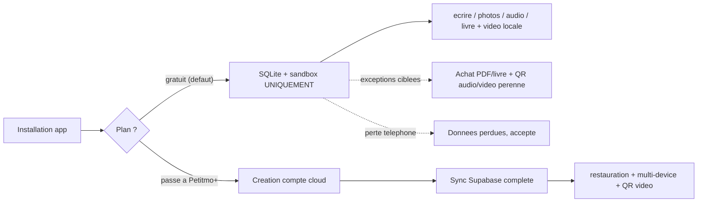

# Architecture Petitmo — Local-first vs Cloud

> **⚠️ Superseeded en partie (2026-07-22)** : la **règle d’or V2** (compte gratuit + sync cloud limitée) est dans [`AGENTS.md`](../../AGENTS.md) et [`.cursor/rules/architecture.mdc`](../../.cursor/rules/architecture.mdc).  
> **En cas de conflit, `AGENTS.md` prime.** Ce document conserve encore des sections « gratuit sans compte / local-only » — à réécrire (chantier doc).  
> Remise print Petitmo+ = **−10 %** (pas 15 %).

> Ancienne intro : référence canonique locale vs cloud. La forme courte agents = `AGENTS.md`.

---

## 1. Règle d'or

Petitmo a **deux modes**, et **deux modes seulement**.

### 1.1 Mode local — plan gratuit, sans compte

- **Promesse produit** : ultra simple, zéro friction, instantané, sans inscription obligatoire.
- Dès l'install, l'utilisatrice peut **immédiatement** :
  - écrire un souvenir texte ;
  - ajouter des photos (seule ou en album) ;
  - enregistrer un audio ;
  - créer un livre avec couverture + photos + **audio et vidéo** (QR cloud **après commande / export payé** uniquement).
- **Stockage** :
  - SQLite local (`expo-sqlite`) ;
  - sandbox / app storage du téléphone (`petitmo_memories/<id>/...`).
- **Conséquences acceptées** :
  - aucun cloud, aucun backup, aucune sync multi-appareil ;
  - **si perte du téléphone, les données sont perdues** (choix produit assumé pour
    tenir la promesse "zéro friction" et permettre l'usage sans création de compte).

#### Exceptions Supabase autorisées en mode local

Le mode gratuit n'écrit en base distante que dans **ces deux cas exclusifs** :

1. **Achat PDF / commande livre** (paiement à l'acte).
2. **Stockage cloud du souvenir audio ou vidéo** uniquement pour un **QR code pérenne** dans un livre **commandé ou exporté payé** (pas une sync du fil). Détail : [`free-tier-book-qr-av.md`](./free-tier-book-qr-av.md).

Hors de ces deux cas, **aucune écriture cloud n'est permise** en gratuit.
Pas de backup automatique, pas de sync silencieuse, pas de "au cas où".

### 1.2 Mode cloud — Petitmo+ (abonnement payant)

**Abonnement = compte** : le paywall vient d'abord, puis la création/lien du compte après paiement réussi — via **Google**, **Apple** ou **email + mot de passe** (dans cet ordre de présentation).
Et active :

- sync cloud bidirectionnelle des souvenirs / enfants ;
- restauration sur nouveau téléphone ;
- multi-device ;
- QR pérennes (audio **et** vidéo) ;
- exports serveur (PDF haute qualité).

### 1.3 Local-first universel (gratuit **et** payant)

**Lecture UI** : SQLite + sandbox sont **toujours** la source affichée (fil, favoris, livres, détail souvenir, profils enfant). Le mode `cloud` (Petitmo+) ajoute sync / backup / restauration — il ne remplace pas le local comme source d’affichage.

| Situation | Comportement |
|---|---|
| Affichage (tous écrans) | Lire d’abord SQLite (`getAllLocalMemories`, `listLocalChildren`, `getLocalMemoryById`…). |
| Hydratation cloud | **Toujours en arrière-plan**, jamais bloquante pour l’UI. |
| Pull cloud → local | Uniquement via `pullMemoriesFromRemoteToLocal` / `pullFamilyMemoriesFromRemoteToLocal` + `mergeServerMemoryRowWithExistingLocal` (préserve les `local_*`). |
| Repli cloud (médias) | Uniquement si le fichier sandbox est **confirmé** absent (`isLocalMediaUriReadable` échoue) et qu’une URL cloud existe. |
| Cloud vide, local présent | Garder le local (migration en cours, hors ligne, bascule gratuit → payant). **Ne jamais** afficher un état vide parce que Supabase n’a pas encore répondu. |
| Bascule gratuit → payant | `upgradeToFullCloud` + upload en arrière-plan ; l’utilisatrice continue de voir ses données locales immédiatement. |
| Réinstall / nouveau téléphone (payant) | Exception : restauration initiale depuis le cloud (§5.2) — puis retour au modèle local-first. |

**Pointeurs code (lecture local-first en cloud)** :

| Donnée | Entrée légitime |
|---|---|
| Fil / favoris | `getFamilyMemories()` → SQLite après pull optionnel |
| Détail souvenir | `getMemoryById()` → SQLite ; repli Supabase + `upsertLocalMemory` si absent |
| Enfants | `getChildren()` → merge local + remote ; repli SQLite si remote vide |
| Hydratation onglets | `hydrateTabScreensFromSqliteSync()` puis `hydrateTabScreensFromLocal()` |
| Migration post-paywall | `services/migration.ts` (`upgradeToFullCloud`), `pendingCloudFlush.ts` |

Détail médias / merge : [`.cursor/rules/local-first-media.mdc`](../../.cursor/rules/local-first-media.mdc).

## 2. Diagramme de flux

---

## 3. Conséquences UX (à appliquer partout)

| Décision | Pourquoi |
|---|---|
| Bouton "J'ai déjà un compte" (login classique) | Autorisé. Si l'email n'a pas de **compte cloud payant**, afficher un message clair + CTA "Créer un compte". |
| Aucun parcours gratuit ne déclenche email/mot de passe | Sinon ça contredit la promesse "sans inscription obligatoire". |
| Aucun texte "tes souvenirs sont sauvegardés" en gratuit | Faux et trompeur. Le badge actuel "Confidentialité 100% préservée" reste correct. |
| Vidéo dans un livre (gratuit) | **Autorisée** en local (max 5 / livre, 30 s). QR cloud **après paiement** commande ou export PDF — voir [`free-tier-book-qr-av.md`](./free-tier-book-qr-av.md). |

---

## 3.1 Distinction critique : email de commande vs compte cloud Petitmo+

Un **email peut exister en base** (gratuit) pour :

- associer une **commande de livre** et ses **QR codes audio** ;
- alimenter le **CRM** (suivi de commande + marketing futur).

Cela ne signifie **pas** qu'il existe un **compte cloud Petitmo+** pour cet email.

Un **compte cloud Petitmo+** = identité (email/Apple/Google) **liée à un abonnement payant**,
autorisant **sync**, **restauration** et **multi-device**.

Source de vérité : **serveur** — champ **`subscriptionTier=paid`** dans **`auth.users.app_metadata`** (Supabase),
alimenté par webhook **RevenueCat** → Edge Function Supabase (Apple IAP / StoreKit sur iOS, Google Play Billing sur Android à venir). **Stripe n'intervient pas dans les abonnements in-app.**
Le tier en AsyncStorage est un **cache UX**, jamais une preuve.

Conséquence UX : sur login, si l'email est connu côté commande/CRM mais **sans compte payant**,
montrer : **"Cette adresse e-mail n'a pas de compte cloud payant associé"** + CTA **"Créer un compte"**.

## 4. Pointeurs code

| Concept | Fichier |
|---|---|
| Mode `local` vs `cloud` (dérivé du tier) | [`lib/userMode.ts`](../../lib/userMode.ts) |
| Tier `free` vs `paid` | [`lib/userTier.ts`](../../lib/userTier.ts) |
| Limites plan gratuit | [`lib/limits.ts`](../../lib/limits.ts) |
| Capture 100% locale | [`services/localOnlyMemoryCapture.ts`](../../services/localOnlyMemoryCapture.ts) |
| Erreur upgrade livre (quotas A/V dépassés) | [`services/books.ts`](../../services/books.ts) `validateFreeTierBookMemoryLimits` |
| QR audio/vidéo gratuit (exception cloud) | [`free-tier-book-qr-av.md`](./free-tier-book-qr-av.md) |
| Device-user Supabase (mécanique interne) | [`app/_layout.tsx`](../../app/_layout.tsx) |
| Écran d'accueil | [`app/onboarding.tsx`](../../app/onboarding.tsx) |
| Modale "Ajouter au livre" + alerte upgrade | [`components/AddToBookModal.tsx`](../../components/AddToBookModal.tsx) |

---

## 5. Cas limites et règles

### 5.1 Réinstall / changement de téléphone — gratuit

- **Souvenirs perdus**, point. C'est assumé produit.
- L'écran d'accueil reproposera "Commencer" → nouveau profil enfant local.
- Ne **jamais** afficher de message du type "voulez-vous restaurer ?" pour un compte gratuit (il n'y a rien à restaurer).

### 5.2 Réinstall / changement de téléphone — Petitmo+

- L'utilisatrice clique **"Restaurer mon compte Petitmo+"**.
- Login via **Google**, **Apple** ou **email + mot de passe**.
- Téléchargement des souvenirs depuis Supabase, écriture en local.
- Pendant le téléchargement, afficher un message doux : **"On restaure tes souvenirs de [prénom enfant], encore quelques instants…"** — obligatoire dès que la restauration dépasse 2 secondes.
- Garde-fou existant (`isProbablyStalePetitmoSandboxPath` dans
  [`utils/localMediaReadable.ts`](../../utils/localMediaReadable.ts))
  pour basculer sur les URLs cloud quand un `file://...petitmo_memories/...`
  pointe vers un fichier qui n'existe plus.

### 5.3 Mécanique du device-user Supabase

L'app crée systématiquement une session Supabase anonyme dans
[`app/_layout.tsx`](../../app/_layout.tsx) (`deviceId@petitmo.local` via la
function `create-device-user`).

- C'est une **mécanique technique** pour rendre possibles les **exceptions
  autorisées** (achat PDF/livre, QR audio/vidéo pérenne après commande).
- **Elle n'est jamais présentée à l'utilisatrice** comme un compte.
- Quand l'utilisatrice passe à Petitmo+ et crée un vrai compte, on peut lier la
  session existante au compte (à concevoir dans un plan dédié).

### 5.4 Utilisateur payant qui clique "S'abonner" par erreur

Si l'utilisatrice clique sur un CTA "S'abonner" ou "Créer un compte" alors qu'un compte cloud Petitmo+ existe déjà pour son identité (email, Apple ID ou Google) :

- Ne pas relancer un parcours de paiement.
- Afficher : **"Tu as déjà un compte Petitmo+, connecte-toi ici."**
- CTA unique : **"Me connecter"** → redirige vers l'écran de login normal.
- Ce cas doit être détecté **avant** d'ouvrir le paywall si possible (vérification serveur), sinon au moment de l'auth post-paiement.

### 5.5 Paiements et source de vérité du tier

**Stack paiement (règle absolue) :**
- **iOS** : Apple In-App Purchase (StoreKit)
- **Android** *(à venir)* : Google Play Billing
- **Middleware** : RevenueCat — valide les receipts, gère les renouvellements, envoie les webhooks
- **Stripe n'intervient pas** dans les abonnements in-app

**Où vit `subscriptionTier=paid` :**
- Dans `auth.users.app_metadata` sur Supabase (option A — standard RevenueCat + Supabase).
- Mis à jour par une Edge Function déclenchée par webhook RevenueCat à chaque événement (achat, renouvellement, expiration, remboursement).
- `app_metadata` est côté serveur uniquement — jamais modifiable par le client.
- L'app le cache dans AsyncStorage (`petitmo:userTier`) via `lib/userTier.ts` — cache UX uniquement, jamais source de vérité.

### 5.6 Sélection du tier (code)

- `lib/userTier.ts` lit la valeur `petitmo:userTier` dans AsyncStorage
  (`'free'` ou `'paid'`).
- `lib/userMode.ts` en dérive `local` ou `cloud`.
- Tout flux qui veut écrire dans Supabase (hors exceptions) doit d'abord
  vérifier `getCachedUserMode() === 'cloud'`.

---

## 6. Cahier de test rapide

### 6.1 Profil gratuit (local-first strict)

1. Désinstaller / réinstaller, créer enfant.
2. Importer 3 photos, 1 audio, **1 vidéo**, créer un livre avec photos + audio + vidéo.
3. Vérifier qu'**aucune** ligne `memories` cloud n'apparaît pour le fil (hors flux commande).
4. Aperçu livre : vidéo visible (poster local). QR actif **uniquement** après commande / export payé (cf. [`free-tier-book-qr-av.md`](./free-tier-book-qr-av.md) §8).

### 6.2 Profil payant

1. Activer Petitmo+ (créer compte).
2. Importer 3 photos + 1 vidéo.
3. Vérifier sync cloud + dérivés (`print_url`, `display_url`, etc.).
4. Ajouter la vidéo au livre : autorisé, QR vidéo OK.

### 6.3 Payant + réinstall

1. Désinstaller, réinstaller.
2. Cliquer "Restaurer mon compte Petitmo+", login.
3. Vérifier que les souvenirs sont rechargés depuis le cloud, sans casser
   sur des `file://` morts.

---

## 7. Drapeaux rouges (signes d'une violation de la règle d'or)

- Du code écrit dans `memories` sur Supabase **sans** vérifier que le tier est
  `paid` ni qu'on est dans une des deux exceptions autorisées.
- Un parcours qui propose login/inscription en plein milieu d'un import gratuit.
- Un texte UX promettant restauration / sauvegarde sans avoir vérifié le tier.
- Un fallback `setUserTier('paid')` automatique sans paiement.
