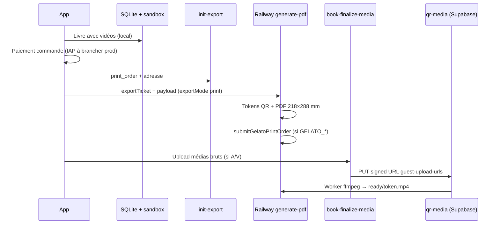

# Gratuit — audio / vidéo dans un livre + QR cloud (exception ciblée)

> **Règle d'or** : le fil reste **local-first** ; en gratuit, **aucune sync cloud générale**.
> Exception explicite : les **médias audio et vidéo derrière un QR de livre commandé ou exporté** peuvent être stockés en cloud **uniquement après paiement** de la commande / export.
>
> Références : [`architecture-locale-cloud.md`](./architecture-locale-cloud.md) · [`qr-media-permanence.md`](./qr-media-permanence.md) · [`qr-media-retention.md`](./qr-media-retention.md) · [`AGENTS.md`](../../AGENTS.md)

---

## 1. Promesse produit (gratuit)

| Action | Autorisé en gratuit ? | Cloud ? |
|--------|----------------------|---------|
| Capturer une vidéo (fil, quotas globaux) | Oui (max 5 vidéos, 30 s) | **Non** |
| **Ajouter une vidéo au livre** (aperçu, spread, maquette) | **Oui** (max **5 vidéos / livre**, 30 s) | **Non** (fichier sandbox + SQLite) |
| QR vidéo **actif** (scan → lecture web) | **Uniquement après commande livre imprimé ou export PDF payé** | **Oui** (bucket `qr-media`, token pérenne) |
| Sync / restauration du souvenir vidéo hors QR livre | **Non** | Paywall Petitmo+ |

**Formulation courte** : la maman peut composer un livre avec vidéos en gratuit ; le cloud ne sert qu’à **faire vivre le QR imprimé**, et **seulement une fois la commande (ou l’export PDF) payée**.

**Ne pas dire** : « vos vidéos sont sauvegardées dans le cloud » en gratuit — seulement : « les enregistrements audio/vidéo **inclus dans votre livre** restent accessibles via le QR pendant X ans » (voir `qr-media-retention.md`).

---

## 2. Limites (plan gratuit)

Définies dans [`lib/limits.ts`](../../lib/limits.ts) et appliquées par [`validateFreeTierBookMemoryLimits`](../../services/books.ts) :

| Limite | Valeur |
|--------|--------|
| Vidéos par livre | 5 (`FREE_TIER_BOOK_VIDEO_MAX_COUNT`) |
| Durée max par vidéo (livre) | 30 s (`FREE_TIER_VIDEO_MAX_DURATION`) |
| Audios par livre | 5 (`FREE_TIER_BOOK_AUDIO_MAX_COUNT`) |
| Durée max par audio (livre) | 60 s (`FREE_TIER_BOOK_VOICE_MAX_DURATION`) |
| Pages A/V avec QR par livre (serveur) | 10 (`FREE_TIER_QR_AV_MAX_PER_BOOK` = 5+5) |

Côté serveur PDF : [`server/src/constants/spec.ts`](../../server/src/constants/spec.ts), [`prepareQrForBook.ts`](../../server/src/pdf/prepareQrForBook.ts).

---

## 3. Ce qui n’est **pas** une sync cloud

L’exception **ne crée pas** un compte cloud ni une ligne `memories` synchronisée pour tout le fil :

- Pas d’upload du souvenir vidéo vers le bucket `memories/` en gratuit.
- Pas de restauration multi-appareil du souvenir hors contexte QR livre.
- Le device-user Supabase ([`app/_layout.tsx`](../../app/_layout.tsx)) sert au **flux commande / export** uniquement.

---

## 4. Flux technique — commande **livre imprimé** (`print_order`)

### Étapes code

| Étape | Fichier |
|-------|---------|
| Garde-fou quotas livre | [`services/books.ts`](../../services/books.ts) `validateFreeTierBookMemoryLimits` |
| Formulaire + init commande | [`app/book-order.tsx`](../../app/book-order.tsx), [`services/printBookOrder.ts`](../../services/printBookOrder.ts) |
| Edge ticket `print_order` | [`supabase/functions/init-export/index.ts`](../../supabase/functions/init-export/index.ts) |
| PDF print + tokens QR | [`services/bookPdfServer.ts`](../../services/bookPdfServer.ts), [`server/src/routes/generatePdf.ts`](../../server/src/routes/generatePdf.ts) |
| File upload `finalize_only` | [`services/pendingRawGuestUploads.ts`](../../services/pendingRawGuestUploads.ts) |
| API unique skip/enqueue A/V | [`services/bookQrAvUpload.ts`](../../services/bookQrAvUpload.ts) + [`bookQrAvUploadSlot.ts`](../../services/bookQrAvUploadSlot.ts) |
| Upload effectif post-commande | [`app/book-finalize-media.tsx`](../../app/book-finalize-media.tsx) |
| Signed URLs upload | Edge [`guest-upload-urls`](../../supabase/functions/guest-upload-urls/index.ts) |
| Pérennce token `ready` | [`docs/specs/qr-media-permanence.md`](./qr-media-permanence.md) |

**Contrat upload A/V (consolidé)** :

1. `guest-upload-urls` → si token déjà `ready` (`alreadyReady` / token sans `signedUrl`) → **skip**, pas de PUT.
2. Sinon + fichier sandbox → enqueue file + PUT signed URL.
3. Ticket JWT : refresh auto sur 401 (même `export_request_id`, QR inchangé).

**Ordre non négociable** :

1. **Paiement** de la commande livre (encaissement Petitmo — IAP / achat à l’acte ; aujourd’hui flux QA sans paiement, **bloquant prod**).
2. `init-export` → `export_requests` créé.
3. `generate-pdf` → PDF + QR (token créé ; média peut être `pending` jusqu’à upload).
4. **`book-finalize-media`** → upload brut audio/vidéo depuis le sandbox vers `qr-media/raw/`.
5. Worker → transcode → `qr-media/ready/` → scan QR OK.

Sans étape 4, le QR est imprimé mais le média peut rester « en préparation » jusqu’à reprise (`processPendingGuestRawUploads`).

---

## 5. Flux technique — export **PDF numérique** payant (`pdf_export`)

Même principe : QR audio/vidéo cloud **après** achat PDF à l’acte (`grantDigitalExportPurchase` / IAP), puis `book-finalize-media` si médias locaux restent à uploader.

Voir [`app/book-order.tsx`](../../app/book-order.tsx) (`exportMode: 'pdf'`) et [`lib/digitalExportPurchase.ts`](../../lib/digitalExportPurchase.ts).

---

## 6. Petitmo+ (cloud)

En abonnement payant :

- Vidéo dans le livre : idem (quotas livre alignés).
- Souvenirs syncés dans `memories` + sandbox materialisé.
- QR pérennes audio **et** vidéo sans attendre une commande livre (export serveur standard).

---

## 7. Politique d’écriture Supabase (rappel)

En mode **local**, écritures cloud autorisées **uniquement** pour :

1. Flux **commande livre / achat PDF** (`export_requests`, CRM, etc.).
2. **Stockage cloud audio ou vidéo** pour **QR pérenne** d’un livre **commandé ou exporté payé** — pas une sync du fil.

Voir [`.cursor/rules/supabase-write-policy.mdc`](../../.cursor/rules/supabase-write-policy.mdc).

---

## 8. Tests QA

### Gratuit — composition livre

1. Créer un livre, ajouter 1–2 vidéos (≤ 30 s).
2. Aperçu spread : vidéo visible (poster local).
3. Vérifier : **aucune** ligne `memories` cloud pour ces vidéos (hors device-user technique).

### Gratuit — commande imprimée

1. Commander l’impression (livre avec ≥ 1 vidéo).
2. Passer `book-finalize-media` si proposé.
3. Scanner le QR du PDF → lecture vidéo.
4. Supabase : `public_media_tokens` `ready` + fichier `qr-media/ready/{token}.mp4`.

### Régression interdite

- Bloquer l’ajout de vidéo **au livre** en gratuit (paywall « vidéo dans un livre ») — **produit obsolète**.
- Upload cloud du souvenir vidéo **avant** paiement commande / export.

---

## 9. Prod — reste à faire (hors doc)

- [ ] **Paiement IAP** commande livre imprimé avant `init-export` (aujourd’hui QA sans encaissement).
- [ ] Gelato + smoke tests ([`server/PROD_CHECKLIST.md`](../../server/PROD_CHECKLIST.md) §7).
