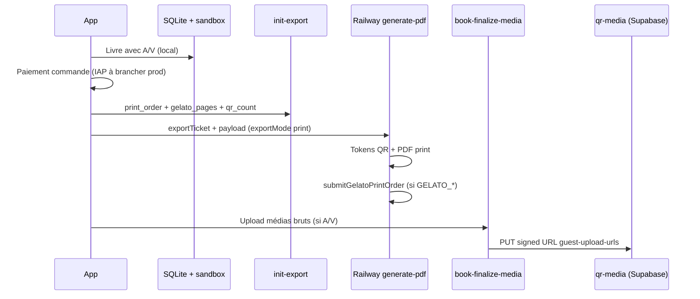

# Gratuit — audio / vidéo dans un livre + QR cloud (exception ciblée)

> **Règle d'or** : le fil reste **local-first** ; en gratuit, **aucune sync cloud générale**.
> Exception explicite : les **médias audio et vidéo derrière un QR de livre commandé** peuvent être stockés en cloud **uniquement après paiement** de la commande imprimée.
>
> Tarification V1 : [`pricing-v1-migration.md`](./pricing-v1-migration.md) · Architecture : [`architecture-locale-cloud.md`](./architecture-locale-cloud.md) · QR : [`qr-media-permanence.md`](./qr-media-permanence.md)

---

## 1. Promesse produit (gratuit)

| Action | Autorisé en gratuit ? | Cloud ? |
|--------|----------------------|---------|
| Capturer une vidéo (fil, quotas globaux) | Oui (max 5 vidéos, 30 s) | **Non** |
| **Ajouter audio/vidéo au livre** (aperçu, spread) | **Oui — composition libre** (pas de plafond 5+5) | **Non** (sandbox + SQLite) |
| QR audio/vidéo **actif** (scan → lecture web) | **Uniquement après commande livre imprimé payée** | **Oui** (`qr-media`, token pérenne) |
| Sync / restauration hors QR livre | **Non** | Paywall Petitmo+ |

**Formulation courte** : on compose librement le livre avec A/V en gratuit ; le cloud ne sert qu’à **faire vivre le QR imprimé**, **après paiement** de la commande.

**Facturation QR (checkout)** : **2 QR inclus** (mix audio/vidéo), puis **0,70 €**/QR. Petitmo+ : QR illimités + −10 % sur la partie pages. Voir [`pricing-v1-migration.md`](./pricing-v1-migration.md).

**V1** : pas d’export PDF monétisé — QR cloud via **impression** uniquement.

**Ne pas dire** : « vos vidéos sont sauvegardées dans le cloud » en gratuit.

---

## 2. Limites (plan gratuit)

| Limite | Valeur |
|--------|--------|
| Pages A/V **par livre** (composition) | **Illimité** (facturation au checkout) |
| Durée max vidéo (livre / fil) | 30 s (`FREE_TIER_VIDEO_MAX_DURATION`) |
| Durée max audio livre | 60 s (`FREE_TIER_BOOK_VOICE_MAX_DURATION`) |
| QR inclus au checkout | **2** (`PRINT_V1_INCLUDED_QR`) |
| Supplément QR | **0,70 €** / QR au-delà |
| Vidéos / audios **fil** (souvenirs) | 5 / 5 (inchangé) |

Garde-fou durée : [`validateFreeTierBookMemoryLimits`](../../services/books.ts).  
Prix : [`lib/pricingV1.ts`](../../lib/pricingV1.ts).

---

## 3. Ce qui n’est **pas** une sync cloud

- Pas d’upload du souvenir A/V vers le bucket `memories/` en gratuit.
- Pas de restauration multi-appareil hors QR livre.
- Le device-user Supabase sert au **flux commande** uniquement.

---

## 4. Flux technique — commande **livre imprimé** (`print_order`)

| Étape | Fichier |
|-------|---------|
| Durées livre | [`services/books.ts`](../../services/books.ts) `validateFreeTierBookMemoryLimits` |
| Quote + formulaire | [`lib/pricingV1.ts`](../../lib/pricingV1.ts), [`app/book-order.tsx`](../../app/book-order.tsx) |
| Edge `print_order` | [`supabase/functions/init-export/`](../../supabase/functions/init-export/) |
| PDF + tokens QR | [`server/src/routes/generatePdf.ts`](../../server/src/routes/generatePdf.ts) |
| Upload post-commande | [`app/book-finalize-media.tsx`](../../app/book-finalize-media.tsx) |

**Ordre** : paiement → `init-export` → `generate-pdf` → `book-finalize-media` (si A/V locaux).

---

## 5. Export PDF numérique (hors V1)

Le parcours `EXPORT_DIGITAL_PDF` / `exportMode: 'pdf'` est **masqué en V1**. Code legacy conservé pour V2 éventuelle.

---

## 6. Petitmo+

- QR A/V **illimités** (0 € supplément) + **−10 %** sur la partie pages du livre imprimé.
- Sync souvenirs + materialisation sandbox.

---

## 7. Politique d’écriture Supabase

En **local** : (1) commande livre, (2) stockage A/V pour QR **après** commande payée. Voir [`.cursor/rules/supabase-write-policy.mdc`](../../.cursor/rules/supabase-write-policy.mdc).

---

## 8. Tests QA

1. Livre gratuit avec **> 5** vidéos (ou **> 10** A/V) ajoutable en aperçu.
2. Checkout : `max(0, qrCount − 2) × 0,70 €` affiché ; pas d’erreur 5+5.
3. Après commande + finalize : scan QR OK.
4. Régression interdite : paywall « vidéo dans un livre » à la composition.
