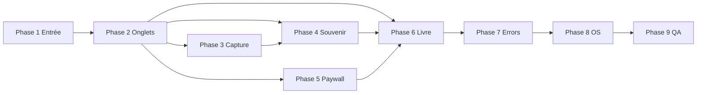

# Roadmap i18n EN — Petitmo V1

> **Contexte** : app quasi finie, peu de nouveaux écrans → migration **exhaustive** des routes + modales + textes système.  
> **Fondation déjà en place** : `lib/i18n.ts`, `locales/fr|en/common.json`, `hooks/useAppTranslation`, `utils/appLocale`, règle `.cursor/rules/i18n.mdc`.

**Hors périmètre UI EN (V1)** : texte des souvenirs, titres de livre saisis, contenu éditorial PDF serveur / dates maquette (`src/book/`, `server/src/pdf/`) — chantier séparé si livre exporté en anglais.

---

## Statut (2026-07) — GELÉ pendant bêta FR

> **Priorité produit** : [`docs/qa/BETA_FR_GO_NOGO.md`](../qa/BETA_FR_GO_NOGO.md) — sortie bêta FR en prod réelle.  
> **Ne pas** démarrer les phases 1–9 ci-dessous tant que la bêta FR n’a pas validé le produit.  
> **OK** : garder la fondation i18n ; nouveaux textes via `t()` si opportun, **sans** sprint migration.

---

## Stratégie

1. **Namespaces JSON** par domaine (pas un seul fichier géant).
2. **Une PR = un lot** (phase ci-dessous) : `locales/fr/*.json` + `locales/en/*.json` + remplacement `t()` dans les fichiers listés.
3. **FR reste la source** : chaque clé existe d’abord en `fr` ; `en` rempli au fil des lots (repli FR automatique tant qu’EN manque).
4. **Ton EN** : charte unique (tutoiement → *you*, chaleureux, court).
5. **QA** : chaque lot = smoke FR + EN (simulateur langue système).

---

## Inventaire routes (`app/`)

| Statut | Fichier | Action |
|--------|---------|--------|
| ⬜ | `app/onboarding.tsx` | Migrer |
| ⬜ | `app/create-child.tsx` | Migrer |
| ⬜ | `app/edit-child.tsx` | Migrer |
| ⬜ | `app/parent-space.tsx` | Migrer |
| ⬜ | `app/(tabs)/_layout.tsx` | 4 titres onglets |
| ⬜ | `app/(tabs)/index.tsx` | Migrer (Capturer) |
| ⬜ | `app/(tabs)/fil.tsx` | Migrer + lier fil |
| ⬜ | `app/(tabs)/favoris.tsx` | Migrer |
| ⬜ | `app/(tabs)/livres.tsx` | Migrer |
| ⬜ | `app/write.tsx` | Migrer |
| ⬜ | `app/camera.tsx` | Migrer |
| ⬜ | `app/record-voice.tsx` | Migrer |
| ⬜ | `app/import-media.tsx` | Migrer |
| ⬜ | `app/edit-photo.tsx` | Migrer |
| ⬜ | `app/memory-viewer.tsx` | Migrer |
| ⬜ | `app/memory-view.tsx` | Migrer |
| ⬜ | `app/book-preview.tsx` | Migrer |
| ⬜ | `app/book-order.tsx` | Migrer |
| ⬜ | `app/book-order-confirmation.tsx` | Migrer |
| ⬜ | `app/book-finalize-media.tsx` | Migrer |
| ⬜ | `app/paywall.tsx` | Migrer |
| ⬜ | `app/+not-found.tsx` | Harmoniser EN (+ header) |
| ✅ | `app/index.tsx` | Rien (loader / redirect) |
| ✅ | `app/book-add-favoris.tsx` | Rien (redirect) |
| ✅ | `app/_layout.tsx` | Rien (shell) |
| ⏭️ | `app/capture-*-mock.tsx` | Hors prod (ignorer sauf besoin QA) |

**Total routes prod à migrer : 22**

---

## Composants & contextes (obligatoires)

| Statut | Fichier | Namespace suggéré |
|--------|---------|-------------------|
| ⬜ | `components/feed/FilMemoryRow.tsx` | `feed` |
| ⬜ | `components/feed/FeedHeader.tsx` | `feed` |
| ⬜ | `components/feed/FeedMediaOverlays.tsx` | `feed` |
| ⬜ | `components/EditTextModal.tsx` | `memory` |
| ⬜ | `components/PermissionModal.tsx` | `permissions` |
| ⬜ | `components/AddToBookModal.tsx` | `book` |
| ⬜ | `components/ImportBatchLayoutModal.tsx` | `import` |
| ⬜ | `components/CropModal.tsx` | `photo` |
| ⬜ | `components/BookPhotoCropModal.tsx` | `book` |
| ⬜ | `components/BookVideoPosterPickerModal.tsx` | `book` |
| ⬜ | `components/PhotoGalleryModal.tsx` | `photo` |
| ⬜ | `components/BookPdfGeneratingOverlay.tsx` | `book` |
| ⬜ | `components/AudioTrimEditor.tsx` | `voice` |
| ⬜ | `components/DatePicker.tsx` | `common` |
| ⬜ | `components/GuestPdfExportModal.tsx` | `book` (legacy PDF — optionnel V1) |
| ⬜ | `components/PetitmoContextTabBar.tsx` | `tabs` (si libellés) |
| ⬜ | `contexts/PendingMediaUploadsContext.tsx` | `errors` |

---

## Namespaces & clés à prévoir (checklist fonctionnelle)

Estimation **~650–850 clés** au total (UI + alerts + placeholders + a11y).  
Ci-dessous : **blocs à extraire** par fichier (à détailler en clés `domaine.action` dans le JSON).

### `locales/{fr,en}/common.json` (déjà amorcé — ~15–25 clés finales)

- Actions : retour, annuler, OK, enregistrer, supprimer, partager, fermer, continuer, réessayer  
- Erreurs génériques : réseau, permission refusée  
- DatePicker : mois, confirmer, annuler  

### `onboarding.json` ← `app/onboarding.tsx` (~20–30 clés)

- Hero, CTA Commencer, lien compte Petitmo+, mentions légales / confidentialité  
- Alertes éventuelles  

### `child.json` ← `create-child`, `edit-child` (~45–60 clés)

- Labels prénom, date de naissance, photo  
- Validation, sauvegarde, suppression profil  
- Alerts (7× `edit-child`)  

### `parentSpace.json` ← `app/parent-space.tsx` (~30–40 clés)

- Sections compte, abonnement, déconnexion, liens légaux  
- CTA paywall  

### `tabs.json` ← `(tabs)/_layout` + barre contextuelle (~8–15 clés)

- Journal, Capturer, Favoris, Livres  
- Tooltips / a11y onglets  

### `capture.json` ← `(tabs)/index.tsx` (~35–50 clés)

- Modes photo / vidéo / texte / voix / import  
- Labels enfant, empty states  

### `feed.json` ← `fil.tsx` + `FilMemoryRow` + overlays (~70–100 clés)

- En-tête fil, empty state, nudges J+30/60/90 (textes avant paywall)  
- Actions ligne souvenir : favori, livre, supprimer, lire la suite  
- Badges type (photo, vidéo, voix, texte)  

### `favoris.json` ← `favoris.tsx` (~100–140 clés)

- Grille, filtres, sélection, ajout au livre (mode overlay)  
- CTAs Annuler / Ajouter, empty states  
- Alerts (6+)  

### `booksTab.json` ← `livres.tsx` (~40–55 clés)

- Liste livres, créer, supprimer (alert), empty  
- Pilules titres  

### `memory.json` ← `write`, `memory-view`, `memory-viewer`, `EditTextModal` (~90–120 clés)

- Écriture texte, titres, troncature texte  
- Détail souvenir, menu actions, partage  
- Visionneuse plein écran  

### `photo.json` ← `camera`, `edit-photo`, `import-media`, modales crop/galerie (~100–130 clés)

- Permissions, capture, filtres, recadrage  
- Import batch, layout modal  
- Alerts nombreuses (`edit-photo` ~20)  

### `voice.json` ← `record-voice`, `AudioTrimEditor` (~60–80 clés)

- Enregistrement, limite gratuit, trim, illustration  
- Alerts (14× record-voice)  
- Succès / erreurs sauvegarde  

### `paywall.json` ← `paywall.tsx` (~75–95 clés)

- **Contextes** : `GENERAL`, `LIMIT_REACHED`, `VIDEO_LIMIT_REACHED`, `VOICE_LIMIT_REACHED`, `EXPORT_PAYWALL`, `EXPORT_DIGITAL_PDF`, `BOOK_ORDER`, `DAY_30`, `DAY_60`, `DAY_90` (titres + sous-titres + interpolation `childName`, `FREE_TIER_LIMIT`)  
- Hero neutre (2 lignes + cœur)  
- Bénéfices (−10 %, QR illimités, cloud…)  
- Plans mensuel / annuel, CTA, restore, legal footer  
- Export PDF (legacy — garder clés si écran encore reachable)  

### `book.json` ← `book-preview`, modales livre, overlay PDF (~140–200 clés)

- Spread, éditeur pages, export, commande imprimée  
- Toolbar, suppression livre, alerts (18+)  
- `BookPdfGeneratingOverlay` titres  
- `AddToBookModal`, crop livre, poster vidéo  

### `bookOrder.json` ← `book-order`, `confirmation`, `finalize-media` (~80–110 clés)

- Tarif V1 (lignes pages / QR / Petitmo+)  
- Formulaire contact, livraison, pays (puces → futur picker)  
- Marketing opt-in, erreurs submit  
- Confirmation, partage PDF, finalize upload A/V, hints réseau  

### `errors.json` ← services + context (~40–70 clés)

- Messages `throw new Error` / `setFieldErrors` remontés à l’UI (`services/books.ts`, `printBookOrder`, limites…)  
- `PendingMediaUploadsContext` alert  
- Mapper **code** → clé quand possible (évite de traduire 200 strings ad hoc dans `services/`)  

### `notFound.json` ← `+not-found.tsx` (~4 clés)

- Déjà partiellement EN — aligner ton Petitmo  

---

## Textes système (App Store / OS) — lot séparé

| Fichier | Contenu |
|---------|---------|
| `app.json` | `NSCameraUsageDescription`, `NSMicrophoneUsageDescription`, `NSPhotoLibraryUsageDescription` |
| Plugins `expo-camera`, `expo-av`, `expo-image-picker`, `expo-media-library` | Même textes EN |
| `locales/en.json` | Métadonnées Expo (déjà créé — compléter clés plist si Expo les y mappe) |

**Estimation** : **0,5–1 j** dev + relecture + **rebuild dev client**.

---

## Roadmap par phases (ordre + délais dev)

Hypothèse : **1 dev React Native** connaissant le repo, **journée ≈ 6–7 h** productives sur l’i18n.  
La **traduction EN** (native) peut se faire **en parallèle** dès qu’un namespace `fr` est figé.

| Phase | Lot | Fichiers principaux | Clés (estim.) | Dev (j) | Traduction EN (j) | QA (j) |
|-------|-----|---------------------|---------------|---------|-------------------|--------|
| **0** | Fondation | *(fait)* | 5 | 0 | 0 | 0 |
| **1** | Entrée & compte | onboarding, create/edit-child, parent-space, tabs/_layout | 90–120 | **2,5–3** | 1 | 0,5 |
| **2** | Onglets cœur | index, fil + FilMemoryRow*, favoris, livres | 250–320 | **6–8** | 2–2,5 | 1,5 |
| **3** | Capture & édition | write, camera, record-voice, import, edit-photo, PermissionModal, AudioTrimEditor | 220–280 | **5–6,5** | 1,5–2 | 1 |
| **4** | Souvenir détail | memory-view, memory-viewer, EditTextModal, PhotoGallery, Crop | 110–140 | **3–4** | 1 | 0,75 |
| **5** | Paywall | paywall.tsx (+ constantes PAYWALL_MESSAGES) | 75–95 | **2–2,5** | 0,75 | 0,5 |
| **6** | Livre & commande | book-preview, book-order, confirmation, finalize, modales book | 260–340 | **7–10** | 2–2,5 | 2 |
| **7** | Finition | errors.json (services), not-found, context upload, GuestPdf modal (opt.) | 50–80 | **1,5–2,5** | 0,5 | 0,5 |
| **8** | Système iOS/Android | app.json permissions EN | 6 | **0,5–1** | 0,25 | 0,25 |
| **9** | QA globale | Parcours E2E FR + EN, layout long, accessibilité | — | **0,5** | — | **3–5** |

\* Inclure `FeedHeader`, `FeedMediaOverlays`, `PetitmoContextTabBar` dans la phase 2.

### Totaux

| Métrique | Fourchette |
|----------|------------|
| **Clés i18n** | **650–850** |
| **Dev extraction + câblage** | **28–38 j·pers.** |
| **Traduction + relecture EN** | **4–6 j·pers.** (peut chevaucher) |
| **QA** | **3–5 j·pers.** |
| **Total projet i18n UI** | **35–49 j·pers.** |

### Calendrier (indicatif)

| Rythme | Durée calendaire |
|--------|------------------|
| 1 dev **100 %** i18n | **7–9 semaines** |
| 1 dev **~50 %** (reste bugs / prod) | **14–18 semaines** |
| 2 devs (lots 2–3 et 6 en parallèle après phase 1) | **5–6 semaines** |

**Ne pas compter dans ce tableau** : fiche App Store EN, CGV / privacy EN, livre PDF dates EN, rebuild TestFlight pour permissions.

---

## Ordre recommandé (dépendances)

- **Phase 6** peut démarrer après **phase 2** (livres/favoris) même si capture pas 100 % — mais **QA livre** exige favoris + fil stables.  
- **Phase 5** tôt si tu ouvres store EN avant livre ; sinon paywall juste avant release EN.

---

## Definition of Done (release EN)

- [ ] Langue système **en** → **aucun** paragraphe français visible sur parcours nominal (onboarding → capture → fil → livre → commande print).  
- [ ] Langue **fr** → régression OK (textes identiques à avant migration ou validés).  
- [ ] `formatAppDate` / `formatAppCurrency` utilisés sur **nouveaux** écrans migrés ; dates fil/livre migrées progressivement.  
- [ ] Permissions OS **EN** sur build TestFlight.  
- [ ] Paywall : tous les `context=` listés traduits.  
- [ ] Pas de régression layout (CTA paywall, book-order, favoris).  
- [ ] (Option) Switch langue manuel dans parent-space — **V1.1**, pas bloquant si suivi système suffit.

---

## Risques qui allongent le planning

| Risque | Impact |
|--------|--------|
| `favoris.tsx` / `book-preview.tsx` (2500+ / 3500+ lignes) | +30–50 % temps sur ces fichiers |
| Messages erreur dispersés dans `services/` | Phase 7 gonfle si pas de codes erreur |
| Ton tutoiement FR vs you EN dans paywall | Relecture marketing +1 j |
| Strings dans `constants` ou helpers partagés | Audit grep `é|è|à` avant clôture |
| **Maquette livre** dates en `fr-FR` hardcodé | Utilisatrice EN voit mois en français **dans le livre** tant que non migré |

---

## Prochaine action concrète

1. Enregistrer les namespaces dans `lib/i18n.ts` (`ns: ['common', 'onboarding', …]`).  
2. **Phase 1** : PR unique `onboarding` + `child` + `parentSpace` + `tabs`.  
3. Lancer traducteur sur JSON `fr` exporté après phase 1 (pas avant — évite double travail).

Référence technique : `.cursor/rules/i18n.mdc`, `AGENTS.md` (pointeurs i18n).
