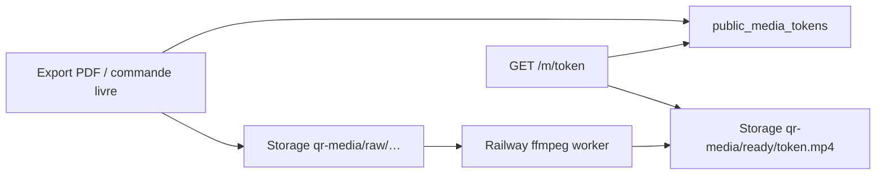

# Rétention QR médias livre — conservation & durée

> **Règle d'or** : le fil complet reste local-first ; seuls les **audio/vidéo derrière un QR de livre** (export PDF / commande imprimée **payée**) sont stockés en cloud — exception explicite. Détail gratuit : [`free-tier-book-qr-av.md`](./free-tier-book-qr-av.md). Voir aussi [`architecture-locale-cloud.md`](./architecture-locale-cloud.md) §1.1.
>
> Spec **prochaine étape dev** (juillet 2026). Référencer ce fichier dans les PR qui touchent durée QR, backup ou copy produit.

---

## 1. Promesse produit (à ne pas confondre)

| Objet | Promesse |
|-------|----------|
| Fil / souvenirs sur le téléphone (gratuit) | **Aucune** conservation cloud — perte du téléphone = perte des données |
| **QR imprimé dans un livre** (audio / vidéo) | **Accès web stable** pendant **X ans** via `https://petitmo.app/m/{token}` (domaine final) |

**Formulation client cible** (FAQ, page commande) :

> Les enregistrements audio et vidéo inclus dans votre livre restent accessibles en scannant le QR code pendant **15 ans** à compter de la date de commande ou d’export du livre.

Variante **Petitmo+** (phase 2 produit) :

> Avec Petitmo+, les médias QR de vos livres restent accessibles **20 ans**.

**Ne pas dire** : « vos souvenirs sont sauvegardés dans le cloud » pour le parcours gratuit global — uniquement pour le **média lié au QR du livre**.

---

## 2. État actuel vs cible

| Paramètre | Code aujourd’hui | Cible spec |
|-----------|------------------|------------|
| Durée accès QR livre | **10 ans** (`BOOK_QR_MEDIA_EXPIRY_YEARS`) | **15 ans** (commande / export) |
| Durée export guest | **10 ans** (`GUEST_EXPORT_QR_EXPIRY_YEARS`) | **15 ans** (aligné) |
| Durée Petitmo+ | idem 10 ans | **20 ans** (tier distinct — phase 2) |
| Format servi | `qr-media/ready/{token}.mp4` ou `.m4a` (H.264/AAC) | inchangé |
| URL QR | `/m/{token}` sur hôte public | **`petitmo.app/m/…`** (domaine maîtrisé) |
| Backup bucket `qr-media` | non automatisé | backup mensuel + export SQL tokens |
| Alertes ops `failed` | logs Railway | alerte si token bloqué > 24 h |
| Pré-expiration | aucune | email / bannière J-90 (phase 3) |

---

## 3. Architecture technique (rappel)

| Composant | Rôle |
|-----------|------|
| `public_media_tokens` | Token stable, `expires_at`, statut `pending_upload → ready`, métadonnées affichage |
| Bucket **`qr-media`** (privé) | Brut guest + fichier **ready** servi au scan |
| `server/src/worker/publicMediaWorkerOnce.ts` | Transcodage → `ready/` |
| `server/src/routes/publicMedia.ts` | Page publique `/m/{token}`, download, retry `failed` |
| Edge `guest-upload-urls` | Upload brut guest + lien token |

**Invariant non négociable** : le QR ne doit **pas** dépendre du compte cloud Petitmo+ ni du téléphone d’origine — seulement du **token** + infra Petitmo.

---

## 4. Piliers solidité

### A. Format pérenne

- Conserver **MP4 (H.264 + AAC)** et **M4A (AAC)** en `ready/`.
- Ne jamais servir le brut iPhone (HEVC `.mov`) directement au navigateur invité.

### B. Stockage

- **Ne pas** supprimer `qr-media/ready/{token}.*` tant que `expires_at > now()` et token non révoqué.
- Pas de job de cleanup agressif sur `raw/` tant que `ready/` n’existe pas (worker idempotent).

### C. Domaine & infra

- QR imprimé → **`EXPO_PUBLIC_PUBLIC_MEDIA_BASE_URL`** = domaine Petitmo (`petitmo.app/m`), pas l’URL Railway nue.
- Railway / VPS = remplaçable ; les tokens en base survivent au changement d’hébergeur.

### D. Transparence

- `expires_at` dépassé → HTTP **410** (déjà implémenté).
- Phase 3 : message humain + CTA prolongation avant coupure.

---

## 5. Roadmap implémentation

### Phase 1 — Spec & durée (priorité immédiate)

- [ ] Passer `BOOK_QR_MEDIA_EXPIRY_YEARS` de **10 → 15** dans `server/src/constants/spec.ts`.
- [ ] Passer `GUEST_EXPORT_QR_EXPIRY_YEARS` de **10 → 15** (même fichier).
- [ ] Vérifier que **tous** les chemins créent `expires_at` :
  - `ensurePublicMediaToken` (`server/src/publicMediaTokens.ts`)
  - `guest-upload-urls` (`bookPublicMediaExpiresAtIso()`)
  - `preparePublicTokensForBook` / export guest
- [ ] **Tokens existants** : décision produit —
  - *Option A (recommandée)* : les nouveaux exports only (pas de migration rétroactive).
  - *Option B* : SQL one-shot `UPDATE … SET expires_at = created_at + interval '15 years' WHERE expires_at < …`.
- [ ] Copy app : page commande / export / FAQ (§8 ci-dessous).
- [ ] Checklist QA : `docs/qa/RELEASE_SMOKE_CHECKLIST.md` — mentionner durée 15 ans.

### Phase 2 — Ops & monitoring (≈ 6 semaines)

- [ ] Script backup mensuel :
  - sync bucket `qr-media` → second provider (S3 / R2 / autre région) ;
  - dump `public_media_tokens` (+ métadonnées display) en JSON/CSV daté.
- [ ] Job hebdo **repair** : tokens `status=ready` mais objet Storage absent → remettre `pending_upload` + relancer worker si `raw/` existe.
- [ ] Alerte (email / Slack) : tout token livre en `failed` > 24 h ou file `processing` > 1 h.
- [ ] Dashboard interne minimal : `#tokens actifs`, `Go qr-media`, répartition `ready/failed`.

### Phase 3 — Expiration & premium (≈ 3–6 mois)

- [ ] Tier **20 ans** si `subscriptionTier === 'premium'` à la création du token (nouvelle constante `BOOK_QR_MEDIA_EXPIRY_YEARS_PREMIUM = 20`).
- [ ] Bannière `/m/{token}` si `expires_at - now() < 90 jours`.
- [ ] Email J-90 si email commande connu (`export_requests.email`).
- [ ] Extension payante ou incluse Petitmo+ (+5 / +10 ans) — produit + Stripe/IAP hors scope initial.
- [ ] Politique **sunset** si cessation d’activité (§9).

---

## 6. Fichiers code couplés

| Fichier | Action Phase 1 |
|---------|----------------|
| `server/src/constants/spec.ts` | `BOOK_QR_MEDIA_EXPIRY_YEARS = 15`, `GUEST_EXPORT_QR_EXPIRY_YEARS = 15` |
| `server/src/publicMediaTokens.ts` | `expiresAtIso` à la création token |
| `supabase/functions/guest-upload-urls/index.ts` | `bookPublicMediaExpiresAtIso()` (dupliquer constante ou partager doc) |
| `server/src/routes/publicMedia.ts` | 410 Expired — OK ; futur message pré-expiration |
| `server/src/pdf/preparePublicTokens.ts` | passe `expiresAtIso` via spec |
| `lib/publicMediaBaseUrl.ts` | domaine public final |
| `AGENTS.md` | une ligne pointer vers cette spec (optionnel) |

**Legacy** : tables `qr_links` / `qr_links_exports` + route `/q/:token` — aligner durée si encore utilisées ; migration progressive vers `public_media_tokens` uniquement.

---

## 7. Tests à ajouter / maintenir

| Test | Attendu |
|------|---------|
| Smoke QR (`scripts/qa/smoke-qr-audio.sh`) | token `ready`, `/m/{token}` joue |
| Token expiré | `expires_at` passé → **410** |
| Nouvel export | `expires_at ≈ now + 15 years` |
| Guest sans compte | QR fonctionne après perte du téléphone source |
| Retry | token `failed` → rescan relance transcodage |

---

## 8. Copy FAQ client (brouillon)

**Les QR codes du livre fonctionnent combien de temps ?**

Les audio et vidéos accessibles via les QR codes de votre livre Petitmo restent disponibles en ligne pendant **15 ans** à compter de la date de création du livre. Passé ce délai, le lien n’affichera plus le média.

**Dois-je garder l’application pour que le QR marche ?**

Non. N’importe qui peut scanner le QR avec un téléphone ou une tablette — l’application Petitmo n’est pas nécessaire.

**Mes souvenirs sont-ils tous sauvegardés en ligne ?**

Non. Seuls les **enregistrements audio et vidéo choisis pour le livre** et associés à un QR sont hébergés pour la durée indiquée. Le reste de vos souvenirs reste sur votre téléphone, sauf si vous souscrivez à **Petitmo+** (sauvegarde cloud complète).

**Que se passe-t-il si je perds mon téléphone ?**

Le QR du livre **continue de fonctionner**. Vos autres souvenirs ne sont récupérables qu’avec **Petitmo+** (compte cloud) ou s’ils étaient déjà dans un livre exporté.

---

## 9. Politique sunset (brouillon juridique / produit)

Si Petitmo cesse son activité :

1. Préavis **minimum 6 mois** sur le site et email aux acheteuses si adresse connue.
2. Pendant **12 mois** : maintien lecture `/m/{token}` ou proposition **téléchargement** du fichier `ready/`.
3. Au-delà : extinction progressive ; les fichiers peuvent être supprimés conformément à la politique de confidentialité.

*(Texte final = avocat / DPO — ne pas publier sans relecture.)*

---

## 10. Checklist ops backup (Phase 2)

Exécution **mensuelle** (cron ou GitHub Action avec secrets) :

- [ ] `rclone sync` ou équivalent : Supabase Storage `qr-media` → destination secondaire.
- [ ] Export SQL : `SELECT * FROM public_media_tokens WHERE expires_at > now()`.
- [ ] Vérifier taille totale & croissance MoM.
- [ ] Test restauration : tirer au sort 1 token `ready`, vérifier lecture `/m/{token}`.
- [ ] Archiver logs Railway worker (ffmpeg failures) 30 jours.

---

## 11. Critères « done » Phase 1

1. Constantes **15 ans** en prod + smoke QR vert.
2. Copy FAQ / commande alignée (app ou site).
3. Aucune régression : gratuit = pas de sync fil ; exception QR audio livre inchangée.
4. `/health` ou doc deploy mentionne version retention spec (`qrWorker` ou champ dédié optionnel).

---

## 12. Références

- [`architecture-locale-cloud.md`](./architecture-locale-cloud.md) — exceptions cloud gratuit
- [`AGENTS.md`](../../AGENTS.md) — règle d'or
- [`docs/qa/RELEASE_SMOKE_CHECKLIST.md`](../qa/RELEASE_SMOKE_CHECKLIST.md) — tests release
- Migration tokens : `supabase/migrations/20260429223000_create_public_media_tokens.sql`
- Expiration : `supabase/migrations/20260505120000_public_media_tokens_expires_at.sql`
